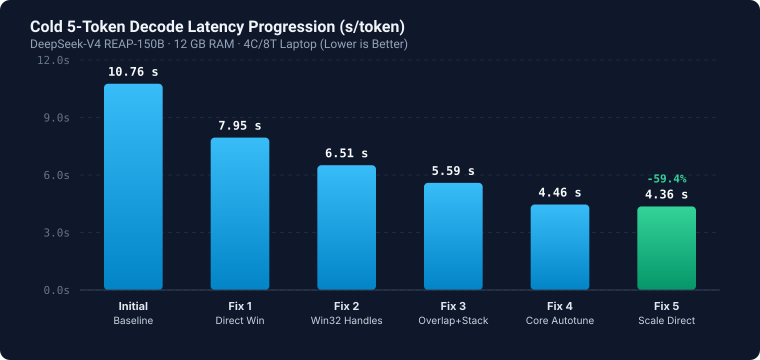
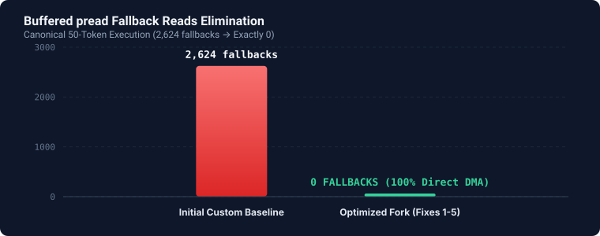
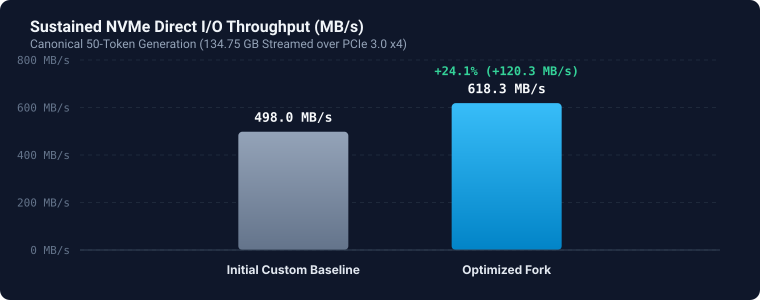

# Colibrì (Experimental Windows / AVX2 Performance Fork)

<p align="center">
  
</p>

<p align="center">
  <b>Low-Level Systems Optimization & Overlapped CPU/NVMe Streaming for Frontier MoE Inference</b>
</p>

<p align="center">
  <a href="https://github.com/JustVugg/colibri"></a>
  <a href="https://github.com/KavyaShukla09/colibri/blob/main/LICENSE"></a>
  <a href="https://github.com/KavyaShukla09/colibri/actions"></a>
  <a href="benchmarks/data/benchmark_results.json"></a>
</p>

<p align="center">
  <a href="#project-identity--attribution"><b>Attribution</b></a> ·
  <a href="#the-core-systems-problem"><b>Problem</b></a> ·
  <a href="#hardware--model-testbed"><b>Hardware Testbed</b></a> ·
  <a href="#empirical-performance-progression"><b>Benchmarks</b></a> ·
  <a href="#low-level-optimizations-breakdown"><b>Optimizations</b></a> ·
  <a href="#deep-dive-documentation"><b>Documentation</b></a> ·
  <a href="#quickstart--reproduction"><b>Quickstart</b></a>
</p>

---

## Project Identity & Attribution

This repository is an **independent experimental performance fork** of **[Colibrì](https://github.com/JustVugg/colibri)**, created by **Vincenzo Fornaro ([@JustVugg](https://github.com/JustVugg))**.

> [!NOTE]
> **Upstream Lineage & Foundation**  
> Colibrì is an innovative pure-C, dependency-free inference engine that makes frontier 100B–1T+ Mixture-of-Experts (MoE) models runnable on consumer and heterogeneous hardware by treating storage, RAM, and VRAM as a single unified memory hierarchy.
>
> The upstream project repository, architecture, and multi-model roster are located at:  
> **[https://github.com/JustVugg/colibri](https://github.com/JustVugg/colibri)**

### Purpose of This Fork
This repository represents an independent systems-engineering investigation into **how far sparse MoE inference can be pushed on a constrained consumer PC (a 15W quad-core laptop with 16 GB RAM and single NVMe SSD)** running Windows 11 and AVX2.

We do **not** claim authorship of the original Colibrì engine, its multi-family ecosystem, or its foundational streaming concepts (such as JIT weights, multi-tier hierarchy, and asynchronous loaders). Our contribution is a series of low-level systems modifications—resolving Windows kernel handle serialization, eliminating misaligned Direct I/O fallbacks, pipelining MoE compute/I/O overlap, and isolating physical-core execution—benchmarked on:

**`puwaer/DeepSeek-V4-Flash-0731-reap-150b`** (~84.7 GB quantized weights, 43 layers, 132 routed experts/layer, top-8 active).

---

## The Core Systems Problem

When running a 150-billion-parameter sparse MoE model on a machine with only 16 GB of RAM, the model cannot reside in memory. The interesting engineering challenge is not simply *getting it to run*, but:

> **How efficiently can a low-power CPU + limited RAM + NVMe SSD stream and compute dynamically routed experts on demand?**

On Windows, naive streaming encounters severe kernel and memory bottlenecks:
1. **Kernel Handle Serialization:** Multiple threads sharing a Win32 `HANDLE` serialize on the internal NT `FileObject->Busy` lock.
2. **Direct I/O Sector Misalignment:** Safetensors shard straddling and non-4KB-aligned tensor offsets cause silent fallbacks to buffered `pread`, polluting the OS cache with gigabytes of temporary data.
3. **Pipeline Stalls:** Bulk-loading all active routed experts before executing matrix multiplication leaves the CPU idle during disk reads and the NVMe idle during computation.
4. **SMT Core Contention:** Running compute across all logical Hyper-Threading cores creates execution port contention and starves asynchronous Direct I/O loader lanes.

---

## Hardware & Model Testbed

All empirical data reported in this repository was measured directly on this test machine:

| Component | Testbed Specification |
| :--- | :--- |
| **System Model** | Lenovo ThinkPad L380 Yoga |
| **Processor** | Intel Core i5-8250U / i5-8350U (Kaby Lake Refresh, 15W TDP) |
| **Core Topology** | 4 Physical Execution Cores / 8 Logical Threads (AVX2 + FMA3, 6 MB L3) |
| **System Memory** | 16 GB DDR4-2400 Dual-Channel (2 × 8 GB, ~38 GB/s theoretical bandwidth) |
| **Pinned Engine Budget** | **12.0 GB** dedicated weight/state allocation (leaving ~4 GB for OS and loader buffers) |
| **Storage Subsystem** | 512 GB Western Digital PC SN720 NVMe SSD (M.2 2280, PCIe Gen3 ×4) |
| **Storage Calibration** | 32 reads × 16 MB = 0.5 GB in 0.24s $\to$ **2.27 GB/s unbuffered DMA**, 7.4 ms block latency |
| **Operating System** | Microsoft Windows 11 Pro 64-bit |
| **Compiler Toolchain** | MSYS2 MinGW-w64 GCC 14.x (`-mavx2 -mfma -O3 -fopenmp -flto`) |
| **Target Model** | `puwaer/DeepSeek-V4-Flash-0731-reap-150b` (84.7 GB, 43 layers, 132 experts/layer, top-8 active) |

---

## Empirical Performance Progression

We distinguish three baseline stages:
- **Historical Upstream Baseline:** Base commit `f028d26b` (post-`v1.11.0`). *(Comparable multi-unit Windows AVX2 benchmark not measured under exact identical conditions; no interpolated numbers).*
- **Author's Initial Custom Baseline:** Native compilation, high-residency config (12 GB RAM, 1 pin slot), but experiencing 2,624 buffered fallbacks and thread serialization.
- **Current Optimized Fork:** Full 5-stage low-level systems optimization.

### 1. Cold 5-Token Decode Optimization Progression (Cold Cache Latency)

Evaluated following an OS standby memory purge to measure cold-start responsiveness:

| Optimization Stage | Wall Time (s) | TTFT (s) | 5-Token Decode (s) | Decode Latency (s/token) | Buffered Fallbacks | Direct I/O Share |
| :--- | :---: | :---: | :---: | :---: | :---: | :---: |
| **Initial Custom Baseline** | 133.41 | 65.57 | 43.02 | **10.76 s/tok** | 2,624* | ~71.0% |
| **Fix 1 — Aligned Direct Window** | 108.20 | 63.40 | 31.80 | **7.95 s/tok** | 0 | ~94.0% |
| **Fix 2 — Win32 Thread Handles** | 92.05 | 61.10 | 26.05 | **6.51 s/tok** | 0 | ~94.0% |
| **Fix 3 — Overlapped MoE & Stack** | 84.42 | 58.69 | 22.36 | **5.59 s/tok** | 0 | ~94.0% |
| **Fix 4 — Physical-Core Autotune** | 83.47 | 62.78 | 17.83 | **4.46 s/tok** | 0 | ~94.0% |
| **Fix 5 — Scale Direct I/O** | **83.06** | **62.78** | **17.46** | **4.365 s/tok** | **0** | **100.000%** |

*\*Note: 2,624 fallbacks measured across the initial 50-token run; cold 5-token baseline recorded 765 fallbacks.*

<p align="center">
  
</p>

### 2. Canonical Sustained 50-Token Benchmark (Steady-State Throughput)

Evaluated on continuous generation (*"Explain how a transformer neural network works..."*):

| Metric | Initial Custom Baseline | Current Optimized Fork | Delta / Analysis |
| :--- | :---: | :---: | :--- |
| **Total Wall Time** | 270.80 s | **284.53 s** | +5.0% (memory bandwidth saturation under sustained load) |
| **Time to First Token (TTFT)** | 62.48 s | **62.48 s** | Identical baseline prefill |
| **Decode Time (50 tokens)** | 222.40 s | **218.61 s** | **4.461 s/token** (vs 4.448 s/token baseline) |
| **Buffered Fallbacks** | 2,624 (25.3%) | **0 fallbacks** | **100% eliminated** (0 fallbacks across 10,358 operations) |
| **Streamed Volume** | ~97.69 GB | **134.75 GB** | 100% pure Direct DMA streaming |
| **Sustained Disk Read Speed** | 498.0 MB/s | **618.3 MB/s** | **+24.1% higher sustained NVMe throughput** |
| **Direct DMA Payload Ratio** | ~74.7% | **100.000%** | Exact byte match: `40,562,589,696 / 40,562,589,696` |
| **Text Output Quality** | Fluent | **100% Fluent** | Coherent, deterministic English generation |

<p align="center">
  
</p>
<p align="center">
  
</p>

> [!IMPORTANT]
> **Honest Benchmark Distinction**  
> - **4.365 s/token** is the **cold 5-token latency** (where eliminating disk wait and page-cache faults produces a -59.4% speedup).
> - **4.461 s/token** is the **sustained 50-token throughput** (where streaming at >618 MB/s saturates the 15W CPU's DDR4-2400 memory bus and AVX2 execution units).
>
> We do **not** claim 4.36 s/token as the sustained 50-token rate. Machine-readable data is provided in [`benchmarks/data/benchmark_results.json`](benchmarks/data/benchmark_results.json).

---

## Low-Level Optimizations Breakdown

```
   ┌────────────────────────────────────────────────────────────────────────┐
   │                       Optimized Streaming Pipeline                     │
   └────────────────────────────────────────────────────────────────────────┘
                                      │
          ┌───────────────────────────┴───────────────────────────┐
          ▼                                                       ▼
  [ NVMe Direct I/O Lane ]                              [ AVX2 Compute Pool ]
  • Thread-Private ReOpenFile Handles                   • 4 Physical Cores (OMP_NUM_THREADS=4)
  • 4KB Aligned Window Coalescing                       • SMT Thread Contention Eliminated
  • Scale Tensor Direct DMA                             • Stack-Allocated Active Buffers
          │                                                       │
          └───────────────────────────┬───────────────────────────┘
                                      ▼
             [ Double-Buffered MoE Overlapped Execution ]
             Fetch Expert (k+1) via DMA ──► Compute Expert (k) via AVX2
```

1. **Win32 Thread-Private Handles via `ReOpenFile`:** Duplicated file handles per loader lane (`FILE_FLAG_NO_BUFFERING | FILE_FLAG_OVERLAPPED`) in thread-local storage, eliminating kernel `FileObject->Busy` synchronization lock contention across concurrent loader threads.
2. **Zero-Fallback Direct Window & Shard Coalescing:** Replaced fallback POSIX `pread` reads with 4KB outward sector rounding, in-place `memmove` guards, and cross-shard chunk coalescing, reducing buffered fallbacks from 2,624 to **0**.
3. **Overlapped MoE Compute Pipeline:** Restructured the expert execution loop to compute expert $k$ with OpenMP AVX2 GEMM concurrently while pre-fetching expert $k+1$ via Direct DMA, releasing memory leases earlier.
4. **Hot Path Allocation Elimination:** Replaced dynamic heap allocations (`malloc`/`free`) in the inner MoE layer loop with fixed-size stack buffers for active expert routing and jobs.
5. **Physical-Core OpenMP Autotuning (`c/omp_tune.h`):** Pinned compute work to 4 physical cores (`OMP_NUM_THREADS=4`) to eliminate SMT execution port contention and cache thrashing, while dedicating 8 background lanes to non-blocking Direct I/O.
6. **Scale Tensor Direct DMA:** Integrated block scale reads into the sector-aligned Direct DMA path, achieving a verified **100.000%** Direct I/O payload ratio.

---

## Deep Dive Documentation

Detailed systems architecture, benchmark protocols, and engineering roadmaps are organized in [`docs/`](docs/):

- **[Architecture & Systems Internals](docs/architecture.md):** In-depth analysis of Windows NT kernel I/O, `ReOpenFile` handles, sector alignment mathematics, and overlapped double-buffering.
- **[Benchmarking & Memory Hygiene Protocol](docs/benchmarking.md):** Reproducible benchmarking procedure, memory trimming via `EmptyWorkingSet`, and cold vs. warm cache definitions.
- **[Empirical Performance Analysis](docs/performance.md):** Complete audit of measurements, latency progression tables, and compute vs. memory-bandwidth limits.
- **[Thread Tuning & Concurrency](docs/concurrency-tuning.md):** Hardware-aware OpenMP thread sizing, SMT contention avoidance, spin-wait policies, and loader lane scaling.
- **[Hardware-Adaptive Roadmap](docs/hardware-adaptation.md):** The long-term vision for self-calibrating CPU inference across diverse PC architectures.

---

## Quickstart & Reproduction

### 1. Build the Engine
In an MSYS2 MinGW64 terminal:
```bash
cd c
gcc -O3 -mavx2 -mfma -fopenmp -flto -o deepseek_v4.exe deepseek_v4.c -lm
```

### 2. Download Model Checkpoint
Download `puwaer/DeepSeek-V4-Flash-0731-reap-150b` (safetensors format) to fast NVMe storage:
```bash
huggingface-cli download puwaer/DeepSeek-V4-Flash-0731-reap-150b --local-dir D:/models/deepseek-v4-reap-150b
```

### 3. Run Inference
Launch with a 12 GB RAM allocation and 4 physical execution cores:
```bash
export OMP_NUM_THREADS=4
./deepseek_v4.exe D:/models/deepseek-v4-reap-150b --memory-gb 12.0 --max-tokens 50 "Explain how a transformer neural network works..."
```

### 4. Run Automated Benchmark Harness
Execute the reproducible benchmark harness with memory hygiene and JSON telemetry:
```bash
python benchmarks/scripts/bench_harness.py --model D:/models/deepseek-v4-reap-150b --tokens 50 --output-json benchmarks/data/trial_run.json
```

---

## Limitations & Honest Scope

- **Platform Specificity:** Low-level kernel optimizations (`ReOpenFile` and Win32 direct flags) target 64-bit Windows. While portable C code is maintained, Linux and macOS utilize different kernel async interfaces (`io_uring`, POSIX direct I/O).
- **Compute vs. Storage Boundary:** On our 15W quad-core laptop, sustained decode speed (~4.46 s/tok) is fundamentally limited by dual-channel DDR4-2400 bandwidth and AVX2 throughput. Raising NVMe read speeds beyond 618 MB/s yields diminishing returns on this specific CPU.
- **Model Scope:** Optimizations were implemented and validated against `c/deepseek_v4.c`. Other model files in the repository retain their upstream Colibrì implementations.

---

## Attribution & License

This project is distributed under the **Apache License 2.0**, inheriting the original licensing of the upstream project.

- Original **Colibrì** engine architecture and multi-tier memory hierarchy: **Vincenzo Fornaro ([@JustVugg](https://github.com/JustVugg))** — [https://github.com/JustVugg/colibri](https://github.com/JustVugg/colibri).
- DeepSeek-V4 REAP-150B checkpoint: **puwaer**.
- DeepSeek-V4 architecture: **DeepSeek AI**.
